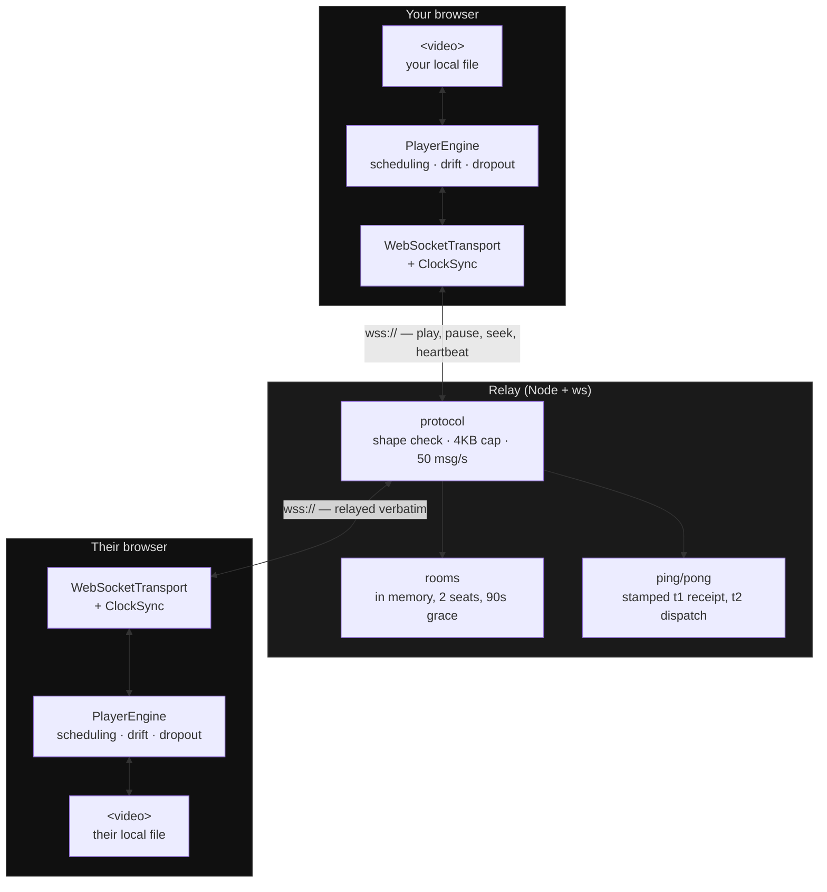

<div align="center">

# ruyah

**Watch the same film together, from two different places — each playing your own copy.**

Nothing but timing crosses the network. The video never leaves your machine.

[](https://github.com/SigniorAtif/ruyah/actions/workflows/ci.yml)
[](LICENSE)

[What it is](#what-it-is) · [How it works](#how-it-works) · [Quick start](#quick-start) · [Deploying](#deploying) · [Docs](docs/)

</div>

---

## What it is

Two people, one film, two separate copies of the file. ruyah keeps the two
players in step over a relay that carries a few dozen bytes every few seconds
and never sees a single frame of video.

Streaming the film to the other person is the obvious approach and the wrong
one. It needs upload bandwidth you probably do not have, it re-encodes
something you already have at better quality, and it puts your file on somebody
else's computer. If you both already have the file, the only thing genuinely
missing is agreement about **when**.

|  | Streaming to a friend | ruyah |
|---|---|---|
| Data sent for a 2h film | tens of GB | a few hundred KB |
| Quality | re-encoded, worse | your own copy, untouched |
| Upload bandwidth needed | a lot | effectively none |
| Who holds your file | a server, or them | only you |
| Accounts | usually | none |

## How it works



The relay is deliberately stupid. It holds rooms, forwards bytes unmodified,
and answers clock pings. **It does not know what a video is**, stores nothing,
and writes nothing to disk.

Four ideas do the real work:

- **One shared clock.** Both sides estimate their offset to the *relay's* clock
  with a burst of ping/pong samples, four-stamp NTP style, taking the reading
  from the fastest round trip. Every scheduled action is expressed on that one
  timeline, so two machines with drifting system clocks still act together.
- **Scheduled execution.** Play and seek are never "do it now". They carry an
  `executeAt` a few hundred milliseconds ahead — sized from the *slower* of the
  two links — so both sides start on the same instant instead of one lagging by
  the network delay.
- **Differential resume.** If one of you is ahead when you pause, resuming
  seeks nobody. The one who is ahead waits out their lead and the other starts
  immediately. Nobody is ever dragged forward over footage they have not seen.
- **Drift correction.** One side is the authority and plays normally; the other
  corrects. Small drift is absorbed by nudging playback rate to 0.98 or 1.02 —
  imperceptible. A visible seek needs three consecutive heartbeats agreeing the
  gap exceeds a second, so jitter can never cause one.

The full story, with diagrams, is in **[docs/ARCHITECTURE.md](docs/ARCHITECTURE.md)**
and **[docs/PROTOCOL.md](docs/PROTOCOL.md)**.

## Quick start

Requires **Node 20+** (CI runs 22).

```bash
git clone git@github.com:SigniorAtif/ruyah.git
cd ruyah

# 1 — the relay
cd server && npm install && node index.js      # ws://127.0.0.1:8080/ws

# 2 — the app, in a second terminal
npm install && npm run dev                     # http://localhost:3000
```

Open <http://localhost:3000>, click **Advanced**, set the relay to
`ws://localhost:8080/ws`. Create a room, send the code to the other person,
both pick your copy of the film, both press **Ready**.

> Both of you need the **same encode**, not just the same film. ruyah
> fingerprints the file and warns you if they differ — two different rips have
> different timestamps, and syncing them is meaningless.

Contributors: see **[docs/CONTRIBUTING.md](docs/CONTRIBUTING.md)** for the
two-window workflow, the network simulator, and the branch layout.

## Configuration

There is no build-time configuration. The frontend is a static bundle that
takes its relay address **at runtime**, so one build works against any relay.

| What | Where | Default |
|---|---|---|
| Default relay shown in the UI | `lib/relayConfig.ts` → `DEFAULT_RELAY_URL` | `wss://your-relay.example.com/ws` |
| Relay listen port | env `RUYAH_PORT` | `8080` |
| Relay bind address | env `RUYAH_HOST` | `127.0.0.1` |

Anyone can override the relay in the UI under **Advanced**; the last value is
remembered in `localStorage`.

Relay addresses must be `wss://`. A browser refuses a plain `ws://` socket from
an HTTPS page and fails **silently**, which is a genuinely miserable thing to
debug — so the app rejects it up front and says why. (`ws://localhost` is
allowed in dev mode, since browsers treat loopback as a secure context.)

## Deploying

### Frontend

Static export. Any static host will do.

```bash
npm run build     # → out/
```

### Relay

Node and one dependency (`ws`). It holds no state worth preserving — rooms live
in memory and a restart costs a 90-second room grace period — so
`Restart=always` is the whole operational story.

```ini
# /etc/systemd/system/ruyah-relay.service
[Unit]
Description=ruyah sync relay
After=network.target

[Service]
ExecStart=/usr/bin/node /opt/ruyah/server/index.js
Environment=RUYAH_HOST=127.0.0.1
Environment=RUYAH_PORT=8080
Restart=always
User=ruyah

[Install]
WantedBy=multi-user.target
```

Put TLS in front of it. Caddy needs four lines and renews certificates itself:

```
your-relay.example.com {
    reverse_proxy /ws localhost:8080
    reverse_proxy localhost:3000
}
```

The relay binds `127.0.0.1` on purpose: TLS terminates at the proxy, and
binding `0.0.0.0` would expose the relay directly, past the certificate.

### Two things that will cost you an evening

Both fail the same miserable way — the connection hangs, with no browser error
and no server log line.

**1. Oracle Cloud has two firewalls.** There is the **VCN security list** in the
web console, and the instance's **own firewall**. Open both.

```bash
sudo firewall-cmd --permanent --add-service=https
sudo firewall-cmd --permanent --add-service=http
sudo firewall-cmd --reload
```

Opening only the console-side rule gives you a port that accepts a TCP
connection and then goes silent.

**2. SELinux on Oracle Linux 9 blocks outbound proxy connections.**

```bash
sudo setsebool -P httpd_can_network_connect 1
```

Without it the proxy returns a gateway error for every WebSocket upgrade while
the relay sits there perfectly healthy, logging nothing, because nothing ever
reached it.

## Privacy

- No accounts, no database, nothing written to disk.
- The relay logs connections, never message contents. Room codes and user
  identifiers are logged as short digests — a room code is the only access
  control in the system, and a display name is a real person's name.
- Room codes come from a CSPRNG over an alphabet with no `I`, `L`, `O`, `0` or
  `1`. They get read aloud, and rooms hold exactly two people.

## Documentation

| Document | What it covers |
|---|---|
| [docs/ARCHITECTURE.md](docs/ARCHITECTURE.md) | Every module, what owns what, and how a command travels end to end |
| [docs/PROTOCOL.md](docs/PROTOCOL.md) | The wire format, the timing model, and the state machines, with sequence diagrams |
| [docs/CONTRIBUTING.md](docs/CONTRIBUTING.md) | Setup, the two-window test rig, the network simulator, how to submit a change |
| [docs/BRANCHING.md](docs/BRANCHING.md) | `main` / `dev` / feature branches and how a release is cut |
| [docs/sync-player-spec.md](docs/sync-player-spec.md) | The original client spec. Section numbers (§6.2, §7.4 …) in code comments point here |
| [docs/ruyah-server-spec.md](docs/ruyah-server-spec.md) | The original relay spec |

## Licence

MIT. See [LICENSE](LICENSE).
